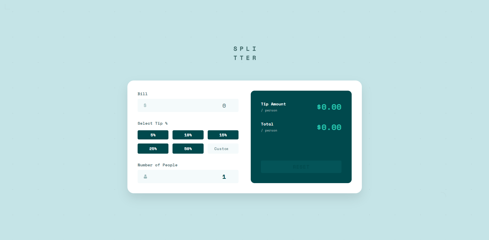

# Frontend Mentor - Tip Calculator App

This is my solution to the [Tip calculator app challenge on Frontend Mentor](https://www.frontendmentor.io/challenges/tip-calculator-app-ugJNGbJUX).

## Table of contents

- [Overview](#overview)
  - [The challenge](#the-challenge)
  - [Screenshot](#screenshot)
  - [Links](#links)
- [My process](#my-process)
  - [Built with](#built-with)
  - [What I learned](#what-i-learned)
  - [Continued development](#continued-development)
  - [Useful resources](#useful-resources)
- [Author](#author)

## Overview

### The challenge

Users should be able to:

- View the optimal layout for the app depending on their device's screen size
- See hover states for all interactive elements on the page
- Calculate the correct tip and total cost of the bill per person
- Input validation with user-friendly error messages
- Persistent data storage using localStorage
- Toggle between light and dark themes

### Screenshot



### Links

- Solution URL: [My Frontend Mentor Solution](https://www.frontendmentor.io/solutions/tip-calculator-with-react-and-typescript-VDUSBRu78w)
- Live Site URL: [Live Demo](https://qs3h.github.io/Tip-calculator-app-with-React-and-TypeScript/)

## My process

### Built with

- **React 19** - Modern React with hooks and concurrent features
- **TypeScript** - Type-safe JavaScript for better developer experience
- **Vite** - Fast build tool and development server
- **CSS Custom Properties** - Dynamic theming with CSS variables
- **CSS Grid & Flexbox** - Modern layout techniques
- **Mobile-first workflow** - Responsive design approach
- **localStorage API** - Client-side data persistence
- **React Context** - State management for theme switching

### Key Features

- **Real-time Calculations**: Instant tip and total calculations as you type
- **Input Validation**: Comprehensive validation with field-specific error messages
- **Data Persistence**: Automatically saves inputs to localStorage
- **Theme Toggle**: Light/dark mode switching with smooth transitions
- **Responsive Design**: Optimized layouts for mobile (375px) and desktop (1440px)
- **Accessibility**: Proper ARIA labels, keyboard navigation, and focus management
- **Type Safety**: Full TypeScript coverage with custom types and interfaces

### What I learned

This project reinforced several important concepts in modern React development:

#### TypeScript Integration

Creating comprehensive type definitions for better code maintainability:

```typescript
export interface UserInputs {
  billAmount: number;
  tipPercentage: number;
  numberOfPeople: number;
}

export interface CalculationResults {
  tipAmountTotal: number;
  totalAmount: number;
  tipAmountPerPerson: number;
  totalPerPerson: number;
}
```

#### Custom Hook Patterns

Managing complex state with useEffect and localStorage integration:

```typescript
useEffect(() => {
  const errors = validateInputs(state.inputs);
  const hasErrors = Object.keys(errors).length > 0;

  if (
    !hasErrors &&
    state.inputs.billAmount > 0 &&
    state.inputs.numberOfPeople >= 1
  ) {
    const results = calculateTip(state.inputs);
    setState((prev) => ({ ...prev, results, errors: {} }));
  } else {
    setState((prev) => ({ ...prev, results: null, errors }));
  }
}, [state.inputs]);
```

#### CSS Custom Properties for Theming

Dynamic theme switching using CSS variables and React Context:

```css
:root {
  --color-primary: hsl(172, 67%, 45%);
  --color-neutral-900: hsl(183, 100%, 15%);
  --color-neutral-50: hsl(189, 47%, 97%);
  --color-white: hsl(0, 100%, 100%);
}
```

#### Pure Functions for Business Logic

Separating calculation logic into testable, side-effect-free functions:

```typescript
export function calculateTip(inputs: UserInputs): CalculationResults {
  const tipAmountTotal = inputs.billAmount * inputs.tipPercentage;
  const totalAmount = inputs.billAmount + tipAmountTotal;

  return {
    tipAmountTotal,
    totalAmount,
    tipAmountPerPerson: tipAmountTotal / inputs.numberOfPeople,
    totalPerPerson: totalAmount / inputs.numberOfPeople,
  };
}
```

### Continued development

Areas I'd like to focus on in future projects:

- **Testing**: Adding comprehensive unit and integration tests with Jest and React Testing Library
- **Performance**: Implementing React.memo, useMemo, and useCallback for optimization
- **Accessibility**: Deeper WCAG compliance testing and screen reader optimization
- **Animation**: Adding smooth micro-interactions and transitions for better UX
- **State Management**: Exploring Zustand or Redux for more complex applications
- **Component Libraries**: Creating reusable component systems with Storybook

### Useful resources

- [React TypeScript Cheatsheet](https://react-typescript-cheatsheet.netlify.app/) - Comprehensive guide for TypeScript in React projects
- [CSS Custom Properties Guide](https://developer.mozilla.org/en-US/docs/Web/CSS/Using_CSS_custom_properties) - MDN documentation for CSS variables
- [Vite Documentation](https://vitejs.dev/guide/) - Official Vite build tool documentation
- [Frontend Mentor Community](https://www.frontendmentor.io/community) - Great community for feedback and inspiration
- [Web.dev Learn CSS](https://web.dev/learn/css/) - Excellent resource for modern CSS techniques

## Author

- Frontend Mentor - [@QS3H](https://www.frontendmentor.io/profile/QS3H)
- GitHub - [@QS3H](https://github.com/QS3H)
- LinkedIn - [Shawky Ahmed](https://www.linkedin.com/in/shawky-ahmed/)
